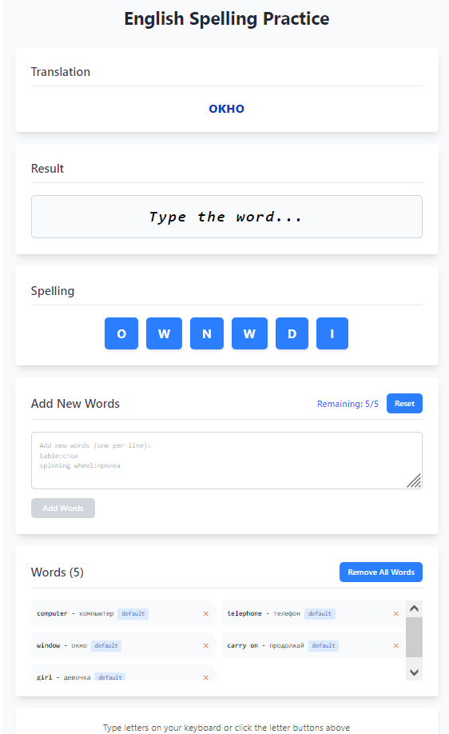

# English Spelling Practice (React)

A focused, accessible, and responsive web app to practice English spelling via progressive letter input and instant feedback. It supports default vocabulary, quick word management, keyboard and click input, and persistent progress.

## Why this project stands out

- Strong UX and accessibility:
  - Keyboard-first typing with clear visual error indicators
  - Mobile-friendly, responsive layout (Tailwind-like utility classes)
- Thoughtful state management:
  - Deterministic word flow with reset, progress tracking, and local persistence
- Practical data handling:
  - Merge user-provided words from textarea with defaults
  - De-duplicate by English term; remove single or all words
- Solid implementation details:
  - Fisher–Yates shuffle for unbiased letter order
  - Clean separation of concerns and small, testable helpers

## Demo

[Live URL:](https://english-spelling-app.vercel.app/])

## Features

- Add new words in bulk via textarea: `english:russian` per line
- Merge with defaults and deduplicate by English word (case-insensitive strategy possible)
- Persist words in `localStorage`
- Remove a specific word or clear all
- Practice loop:
  - Random word selection from remaining list
  - Click letters or type on keyboard
  - Per-letter correctness feedback
  - Automatic advance on success
- “No words remaining” screen with controls to add/reset

## Tech Stack

- React (functional components + hooks)
- Browser `localStorage`
- Utility-first CSS classes (compatible with Tailwind-style classnames)

## Getting Started

1. Clone the repo:
   - `git clone <your-repo-url>`
   - `cd spelling`
2. Install dependencies:
   - `npm install` or `yarn`
3. Run locally:
   - `npm run dev`

Note: The exact scripts depend on your bundler (Vite/CRA/Webpack). Adjust commands to your setup.

## Accessibility & UX

- Keyboard input enabled anywhere except when typing in the textarea.
- Clear color cues and borders to indicate correctness and errors.
- Buttons show disabled states; cursor and hover feedback for clarity.
- Non-breaking spaces render correctly in typed results.

## What I’d Improve Next

- Import/export vocab as JSON/CSV
- Case-insensitive dedup with normalization across the app
- Word difficulty or spaced-repetition-style practice
- Animations for success transitions
- Lists of words

## About Me (Hire Me)
- I build user-centric, reliable, and maintainable UI:
  - Practical features that solve real user problems
  - Clean, modular code with testable helpers
  - A11y and responsive design by default
- I value product velocity without compromising quality:
  - Sensible defaults, safe persistence, and robust input handling
  - Clear UX for both happy paths and edge cases
- I communicate clearly and document decisions.
- I'm available for remote work.
- I'm the best!

- Website/Portfolio: https://pokrovskii.com